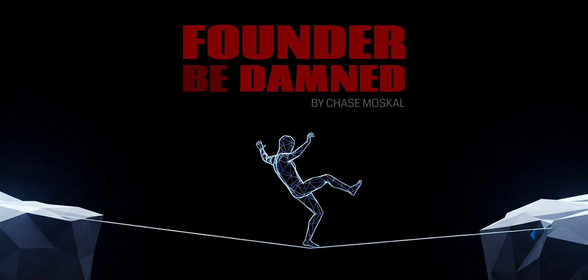

# FOUNDER BE DAMNED
&nbsp; &nbsp; — *by Chase Moskal*

> 🚧 **Work in progress** 🚧  
> This is just a shitty draft that I'm playing with on the side.  
> It's raw clay that I'm shifting around.  
> I'm not done yet.  

 

## Chapter: *Fuck you*

### Delusions of grandeur

Deciding to become a tech founder was an overconfident, grandiose, and arrogant thing for you to do. And you deserve to be punished. And you will be...

A cheap laptop is all you need to touch the lives of millions. Wielding the device properly, you could alchemically conjure vast sums of money into your bank account (among other neat spells). If only you knew how to type the right sequence of keystrokes. Too bad software is the hardest thing in the world.

The right kind of tech founder — *the true builder* — is a wizard with such skills.

But... *you?*

You are inadequate. And you will fail. You'll let everybody down, and your friends and family will lose faith in you. Most will argue against you, hoping for you to fail. You'll even disappoint yourself.

But don't you deserve it, really? After all, you've been cosmically arrogant.

### Encounters with the unforgiving

Imagine trying to become a starcraft grandmaster. How many games should you expect to lose? Stomped. Humiliated. Stupid mistakes! The true builder's path is no different. Except that starcraft is supposed to be fun, isn't it?

But wait, maybe you won't fail building your first tech thing? You could get lucky on your first swing. But then what about the second? Is relying on luck a good strategy? Or, maybe you're already perfectly adequate for the task, just as great as your parents, teachers, and bosses have told you all your life. You won't have any catastrophes! Yeah, you really should get into starcraft — you'll be a *natural.*

Here's the thing though: people *do* attain grandmaster rank, don't they? Watch their twitch streams: are these guys all god-gifted ubermensch gigachads? Or have they just played tens of thousands of games, while losing about half as many? If you're at least a midwit, and you made it your life goal, could you too become a grandmaster one day?

Could you become a grandmaster at building cool tech shit that people love?

### Eating broken glass and staring into the abyss

*Victory or death!* Feels good to say, doesn't it?

Hits different when you're losing balance at the chasm's edge. This won't make you happy. It's not fun. If you have neurotic tendencies, or you're a ruminator, if you get sad sometimes, or somebody depends on you — *then get the hell out!* Go home to your girlfriend, live a normal happy life, watch netflix. Close this now, just remember to set an alarm for work tomorrow.

Still here? You can't be deterred? You really are an arrogant fucker.

You want to do something extraordinary? Well, you don't get to have an ordinary life anymore. That was a privilege, and you just sold it. *Work-life balance,* are you kidding me? Carmack and Blow would like a word with you. And don't forget: every time you fail, you'll have nobody to blame but yourself, and nobody should feel sorry for you. You chose this.

A lust for fat stacks of cash? *Boats 'n hoes?* Forget it! Maybe you'll get that in the end, but in the meantime, may I interest you instead with decades of uncertainty, stress, and workaholism?

Do you have an inexhaustible inner flame? Do you crave power, or recognition? Are you doing God's work? Whatever dude, it better be some deep psychological shit for you to work out with your therapist. Actually, don't — it works better this way.

### Have you at least been doing your homework?

Doesn't it seem like all these startup books are written by "people-people"? Impress an angel investor. Hiring is about *culture.* Networking in the *bay area!* But hold on — didn't somebody have to actually *build* this shit? Fine, you can keep your pg essays, and hammock-driven development.

This book is not written in retrospect. It's about building. It's about the builder's mind. It's about you, your keyboard, and your demons.

This is about what you must become.

 

## Chapter: *The Hustler & The Craftsman*
- (todo)
- protect the golden goose that lays the golden eggs
- hustler cares about returns -- avoids the work; shallow; conman
- craftsman cares about product -- obsesses over the work; deep; drowning

 

## Chapter: *The Drought & The Flood*

### Bad conventions

Creative productivity is a notoriously challenging beast to tame. Pressfield, right?

But you must be careful... your attempts to tame your creativity, may just leave you *buck broken* instead.

Conventional advice is to push through the slog. Defeat Resistance. Set your alarm! Turn off all notifications. Go on a strict dopamine fast. Keto carnivore, athletic greens, sleep hacks, water fasting — *stop fucking fapping!*

This is the wrong approach. Missing the big picture. See, they're trying to equip you to fight the slog, head on. Most of these people haven't actually seen a slog anything like what you're facing now: the *software slog,* a vile ungodly behemoth that actually grows the more you attack at it. This isn't like writing a novel, or producing a fucking podcast episode. They can't even comprehend the enormity of the complexity you're tangled with.

This is not something you can just push through, or chip away one inch at a time. If you let yourself, you really could whittle away at a single software project for 80 years and still end up on your death bed only half done. Ask the dwarf fortress guys or something.

We *need* a better way.

### Feast

You have a brilliant new idea. A new product. An elegant tool. A prophetic vision. People will love it. It's so clear, how did others not see it? You're obsessed with it, you have a crush on it. You write the readme, prototype the architecture, sketch the user experience. In a glorious frenzy of hyper-productivity, an egoless dark-carmack trance, it all comes flooding out of you. In these seven days, you produce more valuable inspired work than three months of the usual slog.

*This is the spark. The feast. The flood.*

It's real. You're not just manic. In fact, this is you at your very best. You must cultivate this. Feed it. Worship it.

### Famine

Like all good things, the honeymoon begins to fade. Progress slows. Every commit feels like pulling teeth. This isn't fun anymore. Your mind starts procrastinating, always looking for any way out. But the project isn't fucking done.

But you're a good boy. Dutiful. Context switching is bad, you've read — so you dig your heels in. *I will finish this. I will focus on it no matter what.* Days disappear. Weeks fly by. What month even is it? Everything you loved about it withers and dies. And, worst of all, you're letting your most valuable asset burn. Time.

*That's the slog. The famine. The productivity desert. The drought.*

If you let it fester, it will ferment into a fine burnout. Don't let it happen.

One thing The Hustler has going for him, is that he will never slog, because he has no patience for it. You need real integrity and devotion to endure a slog. But you never should.

Slogs are the Achilles' heel of The Craftsman, and they'll kill you. Slogs are like those sticky traps, and you're a bug. You have to avoid it. Go around. Find another path.

Oh, and I should be clear: the slog is in fact, the ordinary state of the average working programmer today — a woefully insufficient velocity for a true builder.

### Muse defense

While you're working dutifully, slogging away on your uninspired important critical-path tasks (perfectly arranged linearly on trello as a straight line from here to "boats n' hoes", of course) — you will spontaneously encounter alluring new creative ideas. And they're so damn sexy! Oh my god, if I could just spend three days on it, I would build this incredible little cli, and it might make our work marginally more pleasant, but mostly, it would fill my soul with joy again...

A beautiful virgin muse is gracing you with her delicate ethereal presence. You're in the middle of this stressful slog, hunched over at your desk. She gently massages your clenched shoulders, whispering into your ear...

But you're a good jaded stoic. Context switching is bad, you've read — so what do you do?

You whirl around, punch her in the mouth, and pepper spray her on the floor. *I am honor-bound by my duties, wench!*

That'll show her. Back to the slog...

### Muse harem

Okay, we can work with this, if we understand the mechanics. *We can hack it.* These visits by the muses are the true source of your giga-productive dark-carmack flow states. And that's what you need more of. Nothing is more important for your work. Your entire life should be organized around attracting and inviting these muses.

And you know what's cool about these muses? They visit. If you engage with them, they'll empower you for a little while, maybe a couple days, or up to a few weeks — and then they float away... but if you try to cling, it will curdle into a slog. *So don't cling.* Relax, there will be others.

Btw, these creative muses are the only 72 virgins you'll be getting anytime soon, amiright?

Oh, and another thing: if you're busy with something else, a muse will actually wait around for awhile, maybe for days, weeks, or even a few months. Isn't that nuts? So, when a muse arrives, greet her warmly, and get her number. You want a bunch of these bitches on call. Or stored in your pantry. Or whatever the fuck, you figure it out I'm done with this analogy.

### Foreplay driven development

Your creative mind is a frigid woman who usually isn't in the mood.

That's all I had to say in this section lol.

### Hiking through mud

What you want to do, is always be in "the flood", and never spend any time in "the drought".

Imagine a vast mountainous landscape around you. The landscape is covered in thousands of mountain peaks, and each is a work item you could do. Your "critical path" of work items, is like a straight heading that points due north, as a crow flies.

Getting into the slog is like getting stuck in mud, or ascending a cliff face. Avoiding getting stuck is more important than always going the right direction. What really matters a lot, is that you're an effective fast-moving hiker.

Some of those work items will nourish your soul. Like spending a night in a nice airbnb. Others will offer no refuge, no water, leaving you a dehydrated husk of what you once were.

Better to maintain incredible velocity, and then learn to steer that into a positive direction, than to wallow in a mud pit while having faith in your compass.

On your work landscape, some peaks are particularly attractive. They have manicured pathways, and rope bridges. Half of these, are actually in the wrong direction, away from your success. These are pure distractions. Avoid. Really, you should only pick work items that are both gratifying *and* directionally useful to your success.

### Ring buffer

Start by picking a gratifying target, a small one, and work your heart out on it. Surf that wave of inspired super-productivity. And then, when the wave piddles out, and you tumble into the white water, don't linger. Don't slog. Doesn't matter if you're not "done" that project. Find a new wave.

You want to have a ring buffer of like 10 or 20 projects like this. Work on something for a day. Feeling it? Surf it. Not? Move along to another. Yes, this means you'll be juggling a lot of unfinished projects. Many will actually be yeeted out of the ring buffer when they've gone stale. That's okay. That's darwinian.

The key here, is that absence makes the heart grow fonder. You'll feel the slog coming on, you'll stow the project away and move onto something sexier... but three weeks later, you'll pick it back up, and guess what? It all feels fresh again. You see new approaches and new solutions to old problems you were stuck on before. You see the big picture again. Reinvigorated, your fresh work will be an order of magnitude faster and better than had you stayed slogging.

Don't be caught slogging.

### Doing right things

Yes, yes, I know. If we focus on "doing right things", we'll be more successful than if we "do things right". Classic hustler point, and it should be taken to heart.

That being said, if you want to be a true builder craftsman — being stuck in a mud pit hardly getting anything done is actually complete unmitigated failure, and is not even a valid position on this graph of tradeoffs.

Sure, focus on doing the right things — so long as you're reaching some minimum viable bar of efficiency. And the slog doesn't work, at all.

