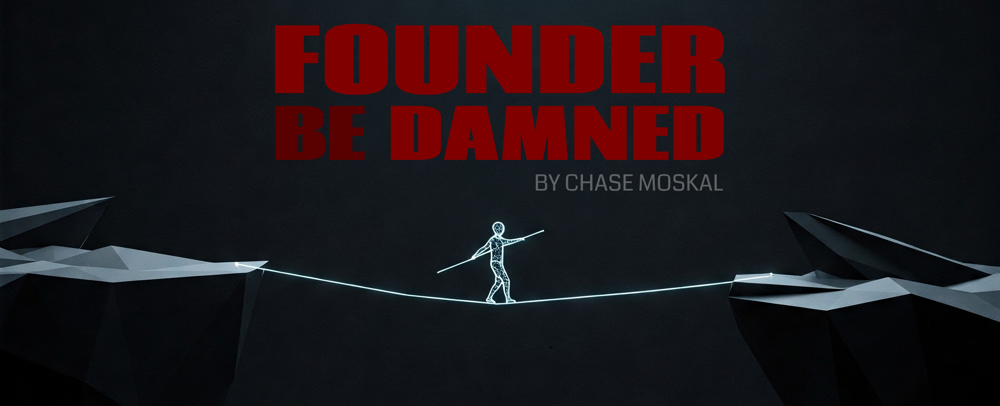

# FOUNDER BE DAMNED
&nbsp; &nbsp; — *by Chase Moskal*

 

## Chapter 1: *Fuck you*

Deciding to become a tech founder was an overconfident, grandiose, and arrogant thing for you to do. And you deserve to be punished. And you will be.

You think you can build your own app, and make money? A new technology, and change the industry? Something beautiful, and people appreciate it? What the fuck is wrong with you, and why do you think you could be a *somebody?*

The truth is, you are *inadequate*. You will fail. You'll disappoint yourself. You'll let everybody down. You'll become a drain. Loved ones will lose faith in you. Friends will argue against you. They'll *hope* for you to fail. *See? I told you...*

But don't you deserve it? After all, you're being *cosmically* arrogant.

### Delusions of grandeur

A cheap laptop is the only equipment required to build incredible things that touch the lives of millions. If only you knew how to type the right keystrokes to pull it off.

Imagine trying to become a StarCraft grandmaster. How many games would you lose? Stomped. Humiliated. Stupid mistakes! Revealed to be inadequate. Could it be otherwise? The path for the technical founder, the true builder, is no different. Well, except that StarCraft is supposed to be fun, isn't it?

But, maybe you won't fail? Maybe you could get lucky on your first swing. But then... what about the second? Or, maybe you're already adequate for the task. You won't have any catastrophes! You're just as great as your parents, teachers, and bosses have told you. Yeah, okay bud... maybe you should get into StarCraft? I think Serral's online today...

Here's the thing: people *do* become grandmasters, don't they? If you're at least a midwit, and you made it your life goal, do you think you could become a grandmaster too? Watch their twitch streams. Do you think these guys are god-gifted wizards, or have they played tens of thousands of games while losing about half as many?

Can you become a grandmaster at making cool shit that people love?

### Eating broken glass and staring into the abyss

*Victory or death!* Feels good to say, doesn't it?

Feels different when you're losing balance standing at the chasm's edge. This won't make you happy. It's not fun. If you're pessimistic, a ruminator, if you get sad sometimes, if people depend on you — get the hell out. Bail and live a normal happy life. Go home to your girlfriend, watch netflix, and get ready for work tomorrow like a good boy. *Close this now!*

Still here? You can't be deterred? You really are an arrogant fucker. You'd better not be a neurote. You know, a person with detectable trait neuroticism? That's not going to fly one bit. In fact, you'd better not let any neurotes get anywhere near you.

If you really want to be extraordinary, then you don't get to have ordinary life anymore. That was a privilege, and you sold it. Work-life balance, are you kidding me? Carmack and Blow would like a word with you. And don't forget: every time you fail, you'll have nobody to blame but yourself, and nobody should feel sorry for you. You chose this.

You'd better be driven by more than a lust for "boats 'n hoes" and "fat stacks of cash". Maybe you'll get that in the end, but in the meantime, may I instead interest you with decades of uncertainty, stress, and workaholism?

So you'd better have an unquenchable inner flame you don't understand. Do you need something worth dying for, to truly live? Hard to find, these days. Do you need power? Recognition? Are you doing God's work? Whatever dude, it better be some deeply-rooted psychological shit for you to work out with your therapist. Actually, don't — it works better this way.

Have you at least been doing your homework? Doesn't it seem like all these damn startup books are written by "people-people"? Impress an angel investor. Hiring is about building *a culture.* The *bay area!* But, they seem to be glossing over something... hey wait — didn't somebody have to actually *build* this shit? Fine, you can keep "Zero to One", the old YC Stanford vids, and your PG essays.

This "book" or whatever, is not written in retrospect. It's about the strategy and tactics of building. It's about the builder's mind. It's about you, your keyboard, and your demons.

This is about what you must become.

 

## Chapter 2: *The Hustler & The Craftsman*
- (todo)
- protect the golden goose that lays the golden eggs
- hustler cares about results -- avoids the work, shallow, conman
- craftsman cares about greatness -- obsesses about the work, deep, drowning

 

## Chapter 3: *The Drought & The Flood*
- (todo)
- productivity deserts
- dark carmack floods

